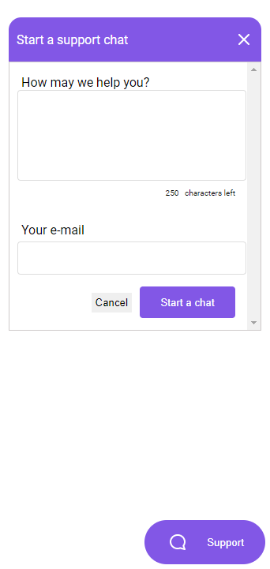

<h1 align="center">Chatty</h1>

<p align="center">
    <a href="#technologies">Technologies</a>&nbsp;&nbsp;&nbsp;|&nbsp;&nbsp;&nbsp;
    <a href="#project">Project</a>&nbsp;&nbsp;&nbsp;|&nbsp;&nbsp;&nbsp;
    <a href="#diagram">Diagram</a>&nbsp;&nbsp;&nbsp;|&nbsp;&nbsp;&nbsp;
    <a href="#how-to-run">How to run</a>&nbsp;&nbsp;&nbsp;|&nbsp;&nbsp;&nbsp;
    <a href="#license">License</a>
</p>

<p align="center">
    
</p>

<br>

<p align="center">
    
</p>

## Technologies

This project was developed with the following technologies:

- [TypeScript](https://www.typescriptlang.org)
- [Node.js](https://nodejs.org)
- [Yarn](https://yarnpkg.com/)
- [Express](https://expressjs.com/)
- [TypeORM](https://typeorm.io/#/)
- [SQLite3](https://sqlite.org)
- [socket.io](https://socket.io/)
- [EJS](https://ejs.co/)

## Project

API that implements a chat, using WebSocket, with instant message.
Who is going to consume the API can customize some informations like: if the chat will be enabled or not, if the chat will have a default initial message, etc. And registration of users who will access this chat.

The conversation history will be kept so that when the user returns, he will be able to access the oldest messages.

## Diagram


## How to run

Prerequisites:

Download and install [Node.js](https://nodejs.org/en/download/) and [Yarn](https://classic.yarnpkg.com/en/docs/install/).

<br>

- Clone the repository
```bash
git clone https://github.com/erickmp07/chatty.git
```
- Install the dependencies with [`yarn` command](https://classic.yarnpkg.com/en/docs/usage):
```bash
yarn
```

<br>

To start the server:
```bash
yarn dev
```

<br>

The application can be accessed at [`localhost:3333`](http://localhost:3333).

The available routes are:
```bash
# GET - Go the chat page for support
http://localhost:3333/pages/client

# POST (JSON) - Create Setting
http://localhost:3333/settings
body: {
    "username": "admin",
    "chat": true
}

# GET - Find Setting by Username
http://localhost:3333/settings/:username

# PUT (Params + JSON) - Update Setting enabling the Chat
http://localhost:3333/settings/:username
body: {
    "chat": true
}

# PUT (Params + JSON) - Update Setting disabling the Chat
http://localhost:3333/settings/:username
body: {
    "chat": false
}

# POST (JSON) - Create User
http://localhost:3333/users
body: {
    "email": "email@domain.com"
}

# POST (JSON) - User sends Message
http://localhost:3333/messages
body: {
    "user_id": "user_id",
    "text": "user message"
}

# POST (JSON) - Admin sends Message
http://localhost:3333/messages
body: {
    "user_id": "user_id",
    "text": "admin message",
    "admin_id": "admin_id"
}

# GET - Show all Messages by User
http://localhost:3333/messages/:user_id
```

## License

Licensed under [MIT](LICENSE) license.